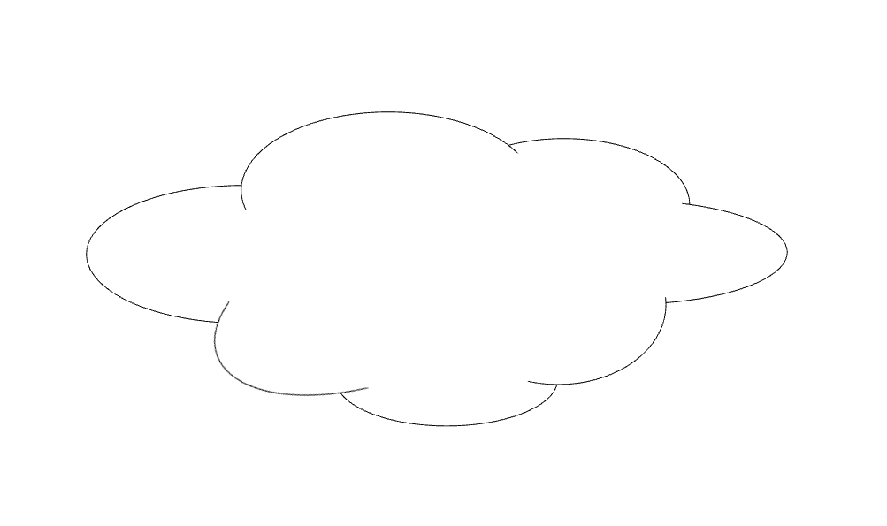
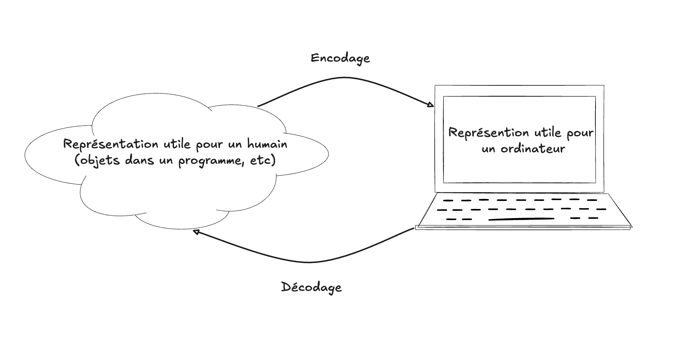

For some weird reason, I always had some kind of slight "mental hesitation" with the meaning of data _encoding_ versus _decoding_.
Which one goes in what direction? To be honest, I have the same kind of weirdness with other concepts: daylight saving time for instance (are
we gaining or losing an hour? I can never tell, sometimes even for many days after a change).

So I wanted to create a diagram to illustrate the dichotomy between encoding and decoding, for a course I'm creating on
software engineering. So one way to "create with AI" would be to ask one: "Can you please create a diagram to illustrate
the difference between data encoding and decoding".

But I know in advance, the _kind_ of diagram I will get, from Gemini (Nano Banana). So I knew that in this particular case, I want to do
it myself, with Excalidraw (which I love greatly). So I asked: "Can you _describe_ a visual schema that would explain it".

Don't do it yourself, just describe it to me. Then I got my answer, something like this:

```
        Source Domain                Target Domain
    (meaningful to humans)      (useful for machines/systems)

        [ Data A ]  ──encode──▶  [ Data B ]
           ▲                         │
           │                         ▼
        decode ◀─────────────────────┘
```

Or something like this:

```
meaning  → (encode) →  representation  → (decode) →  meaning
```

Then I thought ok, I can do that. Then I asked myself, to begin how can I represent _meaning_, the real world? A cloud, of course.
A cloud is clearly the real world.


{.center}

Then I wanted to represent the computer's side of it.. I wasn't sure.. a box? Something else? I asked the AI, got a few suggestions, and went
with the obvious: a schematic computer (schematic enough that I can put a word label in it, like I did with the cloud).

And then I had it:


{.center}

So what I mean by this is that the meaning of "creating with AI" does not have to be fully polarized between "the AI did it entirely by itself" and
"no I kept it fully real, no AI". Creating with AI can be a _process_, where you use the AI to think, brainstorm and iterate, in order
to create something, together.