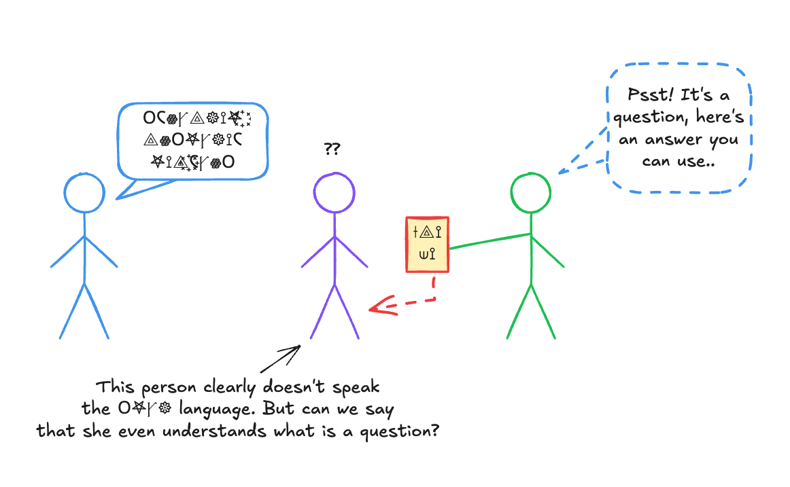

I was explaining to a friend recently that ChatGPT, to its core, is just a
"model" to predict the next word, the one coming after a bunch of other words.

So when you ask it "What is the capital of France?", it does not (really) answer
your question, it completes a sequence of words on which it has been trained,
deeply and efficiently.

So considering that, it might seem that ChatGPT is in a situation that would be
akin to you, if someone tells you a bunch of words you don't understand (in a
foreign language say) and then, someone else gives you a card, on which you can
find some words to pronounce, as a reply (in a language that you don't
understand but can read, let's say).

{.center}

So in a sense, you, and ChatGPT, are in situation that can be compared to the
operator inside Searle's Chinese Room: you can efficiently and procedurally
manipulate a bunch of symbols, but they are meaningless to you. You are blind to
their real meaning.

But then what is, in essence, the act of answering a question? Why would
ChatGPT's way of answering feel "less" authentic than our way, exactly?
Wittgenstein would probably say that all the situations involving answering are
part of a broad "language game" of human behaviors that we call, generally,
"answering a question". There is no deep and unique essence of "answer-ness", or
"question-asking-ness" : there are a multitude of loosely related behaviors,
involving context and language, that we call such.

So I think that the problem that this poses is really a problem of a priori
modeling : for as long as the idea of AI existed, the a priori model of language
understanding (and by implication question answering) has always been : you
receive a sequence of symbols (words), and then you have some kind of processing
mechanism, that is in charge of "understanding" these words, that is, build some
kind of (internal) representation of their meaning, whatever that "thing" might
be (some internal mental model, state, or configuration, whatever). Only from
that point, once you have that, can something follow (an answer, in the case of
question answering), that could be first conceived, and then executed.

{.center}

But then it seems that large language modeling puts that model into question. It
seems that real understanding can emerge from the mere fact of adequately
learning to predict a sequence, without the need for that "intermediate", black
box modeling, and that is a very deep and unsettling change of paradigm.

{.center}
