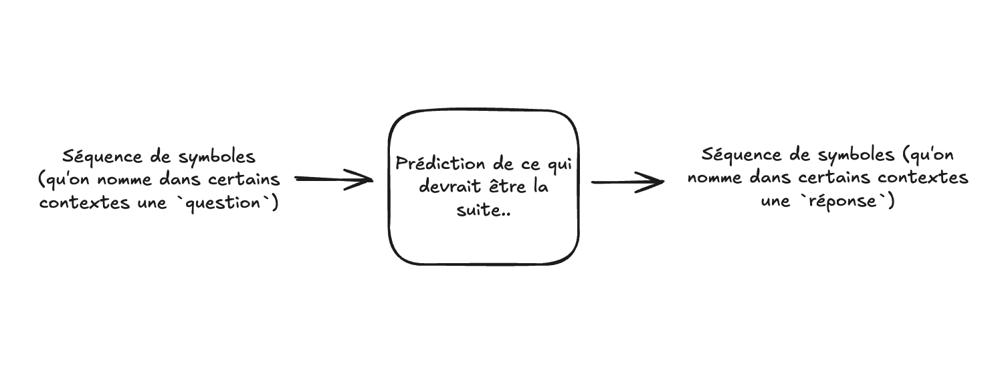

J'expliquais récemment à un ami que ChatGPT, dans son essence, est « juste » un
modèle de prédiction du mot suivant, celui qui vient après une suite d'autres
mots. Ainsi, quand on lui demande « Quelle est la capitale de la France ? », il
ne répond pas (vraiment) à la question : il complète plutôt une séquence de mots
sur laquelle il a été entraîné, en profondeur et avec une très grande
efficacité.

En considérant cela, on pourrait dire que ChatGPT se trouve dans une situation
comparable à la vôtre si quelqu'un vous récitait une suite de mots que vous ne
comprenez pas (dans une langue étrangère, disons), puis qu'une autre personne
vous tendait un carton sur lequel figurent des mots à prononcer en guise de
réponse (dans une langue que vous ne comprenez pas mais que vous pouvez lire,
disons).

{.center}

En un sens donc, vous (et ChatGPT) vous trouvez dans une situation analogue à
celle de l'opérateur dans la [Chambre chinoise de
Searle](https://fr.wikipedia.org/wiki/Chambre_chinoise) : vous pouvez manipuler
efficacement et de manière procédurale un ensemble de symboles, mais ceux-ci
n'ont aucun sens pour vous. Vous êtes aveugle à leur signification réelle.

Mais alors, qu'est-ce que c'est, au fond, que l'acte de répondre à une question
? Pourquoi la manière dont ChatGPT répond nous semblerait-elle « moins »
authentique que la nôtre, exactement ? Que signifie même le fait de comprendre
que quelque chose est une question ? Wittgenstein dirait probablement que toutes
les situations impliquant le fait de répondre font partie d'un vaste [jeu de
langage](https://fr.wikipedia.org/wiki/Jeu_de_langage_(philosophie)), soit un
ensemble de comportements humains que l'on regroupe, de manière générale, sous
l'appellation « répondre à une question ». Il n'y a pas d'essence profonde et
unique de la « réponse-ité », ni de la « question-ité » : il y a une multitude
de comportements vaguement apparentés, impliquant des contextes particuliers et
le langage, que nous désignons ainsi.

Ce que cela pose comme problème, selon moi, en est un de modélisation a priori :
depuis aussi longtemps que l'idée d'IA existe, le modèle a priori de la
compréhension du langage (et par implication, de la capacité à répondre à des
questions) a toujours été le suivant : on reçoit une séquence de symboles (des
mots), puis un mécanisme de traitement se charge de « comprendre » ces mots,
c'est-à-dire de construire une sorte de représentation (interne) de leur
signification, quelle que soit la nature de cette « chose » (un modèle mental
interne, un état, une configuration, peu importe). Ce n'est qu'à partir de là,
une fois cette représentation acquise, que quelque chose peut s'ensuivre (une
réponse, dans le cas où l'on répond à une question).

{.center}

Or il semble que la modélisation avec les grands modèles de langage remette ce
schéma en question. Il semble qu'une compréhension réelle puisse émerger du
simple fait d'apprendre à prédire adéquatement une séquence de mots, sans qu'il
soit nécessaire de passer par cette modélisation intermédiaire, cette boîte
noire qui « comprend » quelque chose. Et c'est là un changement de paradigme
très profond et déstabilisant.

{.center}
