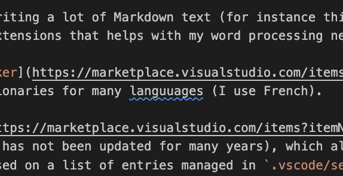
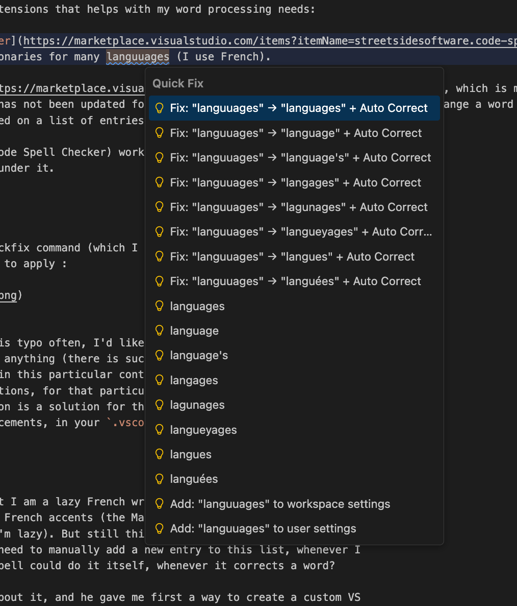

With VS Code I am writing a lot of Markdown text these days (for instance this
Hugo blog) and I'm using two extensions to help with my word processing needs:

1. [Code Spell Checker](https://marketplace.visualstudio.com/items?itemName=streetsidesoftware.code-spell-checker), which has a bunch of dictionaries for many languages (I use French).

2. [Auto Correct](https://marketplace.visualstudio.com/items?itemName=sygene.auto-correct), which is much more obscure extension (its code has not been updated for many years), which allows to automatically change a word to another
one, as I write, based on a list of entries managed in `.vscode/settings.json`.

So the way cSpell (Code Spell Checker) works is this: if a word is misspelled,
you get a blue squiggle under it:

{.center}

I can invoke the quickfix command on it (which I have as a shortcut) to get a
list a possible corrections to apply :

{.center}

However if I make this typo often, I'd like to have a way to auto-correct it,
without having to do anything (there is such a function at the OS level, in
MacOS at least, but in this particular context I want to manage a specific list
of corrections, for that particular writing project). So the Auto-Correct
extension is a solution for that: it allows you to manage a list of automatic
word replacements, in your `.vscode/settings.json` file :

{.center}

Here you can see that I am a lazy French writer, and that I prefer to not have
to type the annoying French accents (it's true that the MacOS keyboard makes
this not too painful, but still I'm lazy). But still this does not satisfy fully
my extreme laziness, because I need to manually add a new entry to this list,
whenever I want one. What if cSpell could do it itself, whenever it corrects a
word?

So I asked ChatGPT about it, and he gave me first a way to create a custom VS
Code extension with `yeoman` and `generator-code`, of which I was vaguely aware.
So I tried it, but it was not working, and it's clunky to debug, with all the
copy-pasting involved. So I switched my strategy: I called Claude Code (the VS
Code extension version) from the extension's newly created (but still not
working) project, and asked Claude Code to fix it. The nice thing about CC is
that because it works from the context of your project, the manipulations are
easier. I still had to have a few rounds of refinement with CC, but eventually
it worked, and here is the result:

{.center}

So here you go: I vibe coded with ChatGPT and Claude Code something that I
wasn't even sure was possible: an VS Code extension that acts as a bridge
between two other extensions, in order to implement a very specific behavior I
wanted.

The code of this custom extension is available on my
[GitHub](https://github.com/cjauvin/vscode-cspell-to-autocorrect/tree/main).