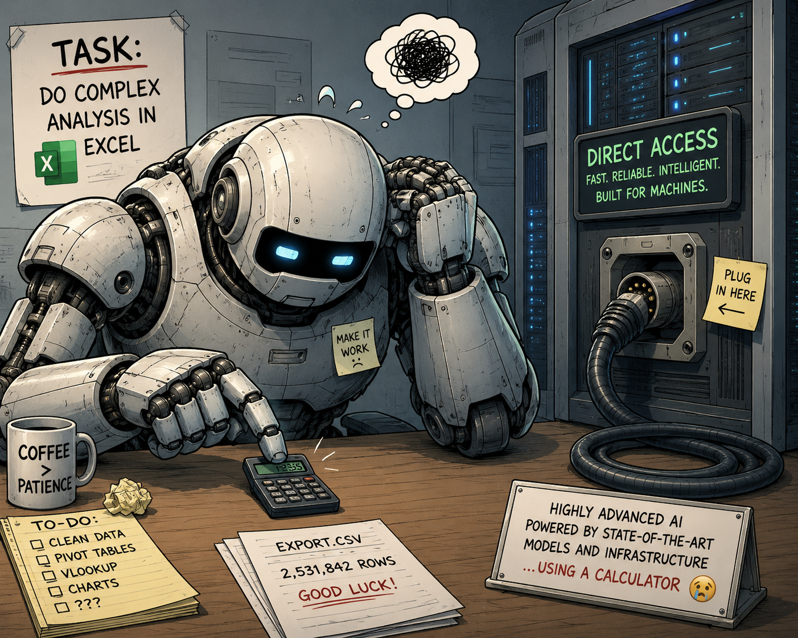

When I was studying as a CS undergrad in 1998 at the University of Montreal,
every student had a Linux account with a special folder in their `$HOME` where
you could put stuff which would be instantly served on the web. It took me a
while to see the beauty of it, because at that time, I didn't know much about
the web and Linux.

Fast-forward in 2026, and I now work as a professor at an online university, and
it's strangely difficult to host anything online in that environment. Actually,
it's next to impossible. The only thing I have is an extremely slow and clunky
web app to edit my home page. And whenever I change something using it, I'm
always scared that I'm going to break or delete something. The only mechanism
that is available for publishing stuff is based on Moodle, but it's meant for
the courses, and it's not particularly user-friendly. So me and my (very few)
colleagues, who want to publish stuff online in a more flexible way, are forced
to use external platforms. But of course the University sees that with
suspicious eyes. To someone who doesn't know about it, Github might appear like
a potentially "dangerous" platform. Who knows? Code is scary, because hackers
are scary!

So I asked around, to try to understand why this is the case. I could not get
satisfying answers. Someone told me recently it's related to insurances, I
didn't find that very convincing.

So what happened? I think I know what happened: Windows. I don't know it for a
fact, but I suspect that In 1998, the CS department of UdeM was probably being
very happy to be left alone running Linux, while the rest of the university was
probably running on a much less sophisticated mix of primitive Windows tools
(yes Office, etc) and a healthy dose of pens, papers and printers. And I suspect
that this particular dual recipe might have been some kind of sweet spot, in
terms or bureaucratic culture. But during the almost three decades that
followed, the bureaucratic and work culture became more and more computerized (I
don't even want to say automated, because I don't really think that it was the
case). And the bulk of this computerization process, for the human part of the
work culture (as opposed to the non-human part, servers, etc) was NOT done with
Linux, but with Windows, of course. And that is how we got to the point where we
are. Say what you will, MS Word, Excel, Teams, Copilot and Sharepoint are NOT
good tools to run and foster a healthy technological work environment. Those
tools are clunky, confusing, web-hostile (and more generally user-hostile, IMO)
and do not generally spark a lot joy. Microsoft doesn't really know how to make
good tools anymore (except for dev tools like VS Code, which is a strange little
miracle, if you think about it). Sure a lot of people don't really care or
notice, and some people never saw or imagine, what else it could be. Sure Excel
is powerful, easy and universal, but up to a point. Excel is good on a single
computer with local files, but it's much less good in a distributed, shared
environment. And with the current AI revolution underway, the dirty secret is
that it's only getting worse, because the most spectacular aspect of the current
AI is (computer) tool usage, and asking an AI to use Excel or Teams, even though
completely possible, is not as easy and powerful as using some other kind of
more appropriate tools.

{.center}
